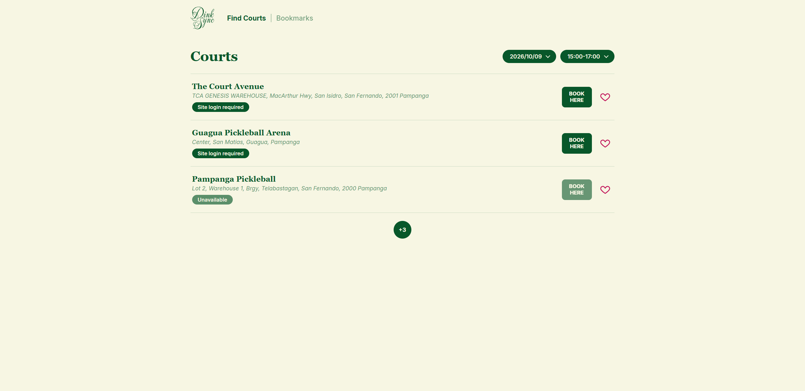

# DinkSync

A personal project designed for easily navigating to the courts I regularly visit without filling up my local bookmarks.

**Live site:** https://fromhelio.github.io/DinkSync/
**API:** https://dinksync-backend.onrender.com
**Demo video:** (link)

## What it does

- Provides direct links to court booking sites
- Shows availability for specified times (if capable)

## Built with

React and Vite on the front end, Express and PostgreSQL on the back end. The
client is on GitHub Pages, the API on (host), the database on (host).

React and Vite for the frontend. Express, PostgreSQL, and good old JSX for the backend. Client is hosted on Github Pages, the API on Render, and the database on Supabase.

## Architecture

The client talks to the server, which itself talks to the database– a classic three-tier architecture. Github Pages, where the client lives, thus only talks to Render. Render, on the other hand, interfaces with Supabase through its connection string.

## What I would do next

- Add the ability to add more courts in-app
- Account system for use beyond just myself
- More robust availability searching to cover apps beyond those covered by Rezerv and Coura

## AI CREDIT
This site was made possible with the assistance of Artificial Intelligence Tools (AI), notably Claude and Gemini. Please view AI_USAGE.md for additional information.
